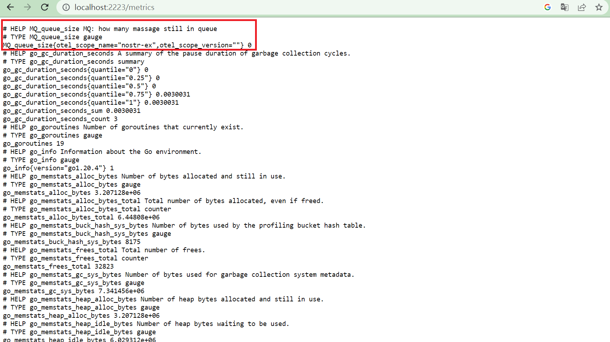
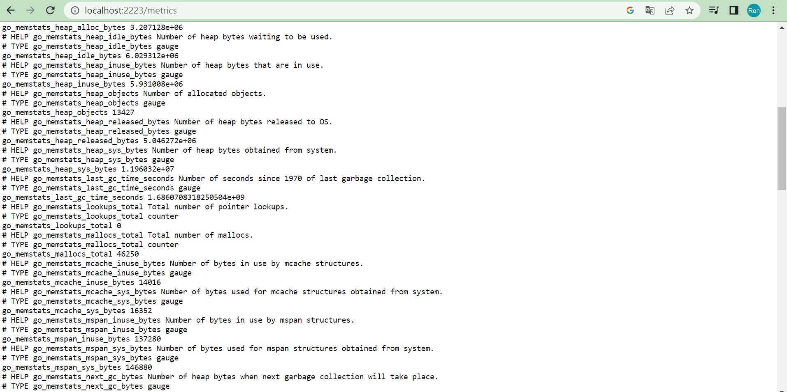
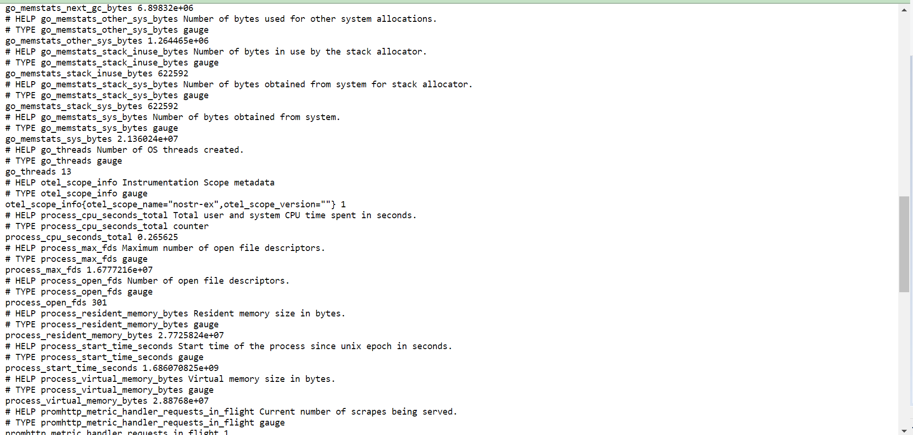
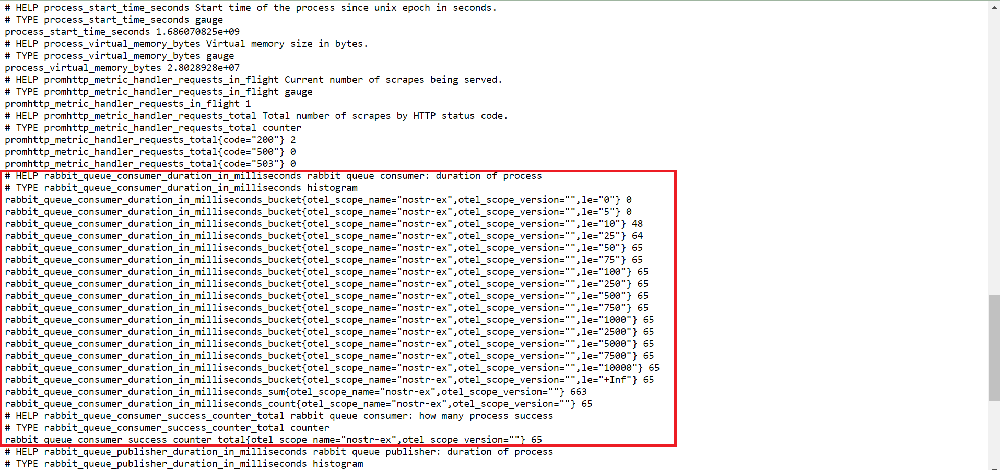
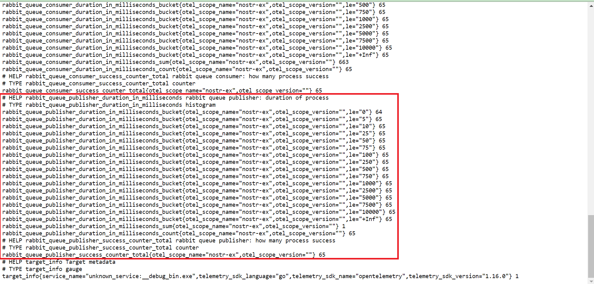

# Distributed Systems Project 

## Prerequisites

- Go: v1.20.4

## Usage

* Rename .env.example to .env
* Set value of AUTOMIGRATE=1 in .env to migrate Database table at first time
* Change value of MQ_URL in .env for RabbitMQ
* Run docker-compose to start db
 ````
 docker compose up
 ````
* Run project at  http://localhost:8800/ for default
* Aggregator will connect to wss://relay.nekolicio.us/ for default relay

* Post API to add relay

    * POST http://{{serve}}/relays
    * EX:POST http://localhost:8800/relays

* Example of API body when POST http://{{serve}}/relays
```
    {
        "url":"wss://relay.nekolicio.us/"
    }    
```
* Get API to get list of relays
    
    * GET http://{{serve}}/relays


* view:  http://localhost:8800/watcher for default
* view:  http://localhost:2223/metrics for phase 5 to check metrics
    * 目前還在研究如何整合到grafana，暫時只能用以上頁面顯示

## Stop database which is builded from docker compose
 ````
 docker compose down
 ````

 ## Questions
 ### Phase 3
 #### **Why did you choose this database? Is it the same or different database as the one you used in Phase 2? Why is it the same or a different one?**
 - 我使用postgresql，和phase2是一樣的，因為想使用比較熟悉的DB先將功能開發到一定程度，也可以藉此機會看看此DB是否負荷的住此種情景。
 #### **If the number of events to be stored will be huge, what would you do to scale the database?**
 - 寫入DB的部分先嘗試分表，如果不行再嘗試分DB。
 ### Phase 4
 #### **Why did you choose this solution?**
 - 我使用rabbit queue，因為聽起來他功能足夠而且比kafka容易使用
 - 目前一個relay會有一個生產者，但整個系統只會有一個消費者；因為目前還沒有研究如何fan out。另外也可以藉由這個機會看看會有甚麼狀況，來增加後續的error handle。

 #### **If the number of events to be stored will be huge, what would you do to scale your chosen solution?**

 - 增加consumer
 - 寫入DB的部分先嘗試分表，如果不行再嘗試分DB
但寫入策略必須要計畫一下。
 ### Phase 5
 #### **Why did you choose these 5 metrics?**
- queue size: (搜尋queue_size)因為存在生產者消費者問題，觀察queue size的大小可以知道此一關聯。但在rabbit queue已有dashboard可以觀看這些指標。但如果可以集中式控管應該更為方便，只是可能可以用直接接入rabbit queue來取得這些數據。
- database: 如果接入大量relay會有大量的寫入，如果有很多連線連接到watcher會有大量的讀取，因此觀察資料庫的運作狀況。目前用otelsql接入，但還沒有研究如何導出到UI顯示。
- duration: (搜尋duration_in_milliseconds)觀察函數的運作時間是否在合理範圍。

- success counter: (搜尋success_counter) 觀察函數運作成功的數量，可以藉由失敗和成功的比例評估是否合理。


- fail counter: (搜尋fail_counter) 觀察函數運作失敗的數量，可以藉由失敗和成功的比例評估是否合理。
#### **What kind of errors or issues do you expect them to help you monitor?**
- 當queue size越來越大時，考慮需要用甚麼樣的方式增加consumer。
- 當duration越來越大時或過大不合理時，需要追查瓶頸在哪邊，可以先看database的數據是否瓶頸在database。如果不是就可以追查其他地方。
- 當fail/success大於一定值時，可以警示去追查是否系統有問題或是程式有問題。

#### **If you had more time, what other tools would you use or metrics would you instrument and why?**

- 嘗試一些公有雲的工具，看看是否可以更方便的使用或是功能更強大。
- 去研究一些可以判斷健康狀態的常用指標。
### http://localhost:2223/metrics




